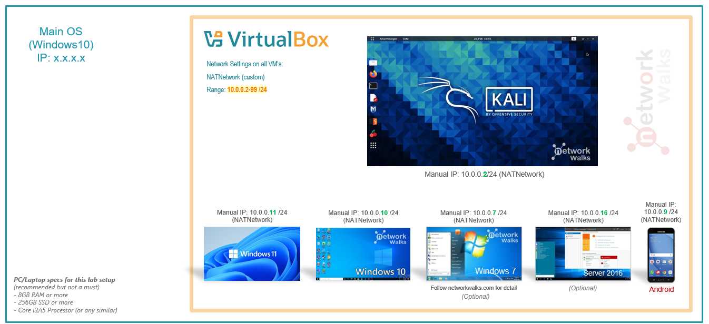
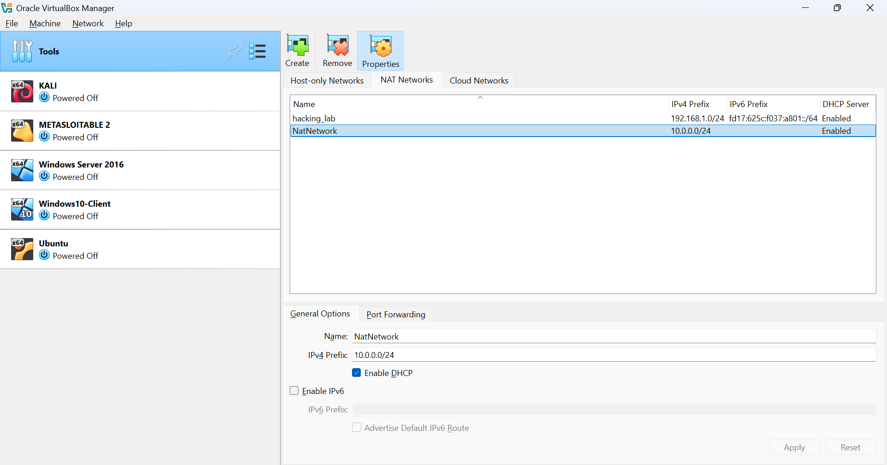
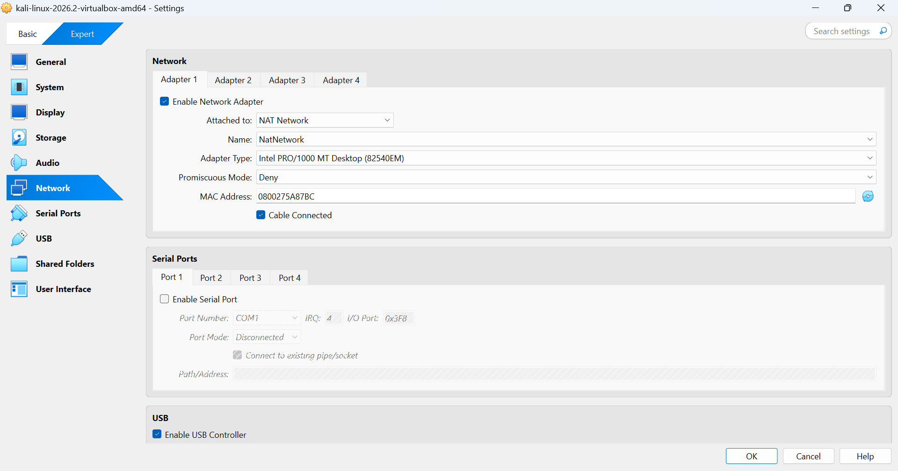
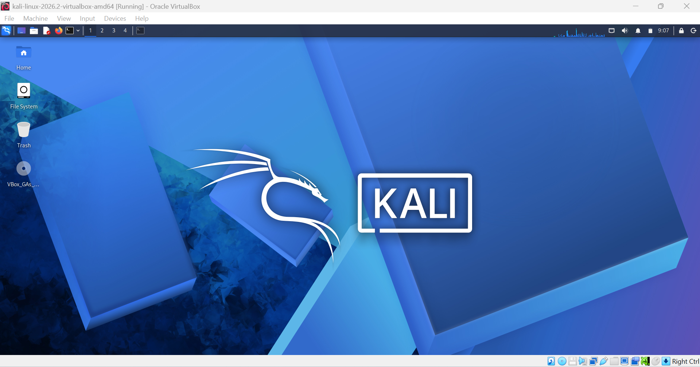
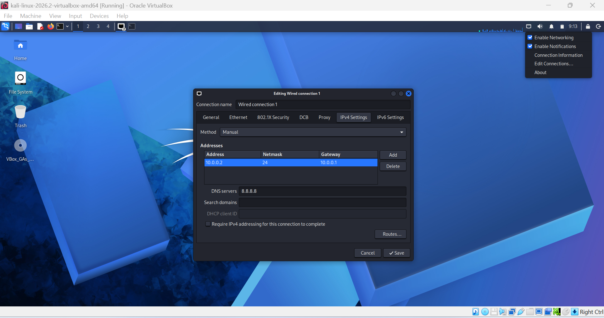
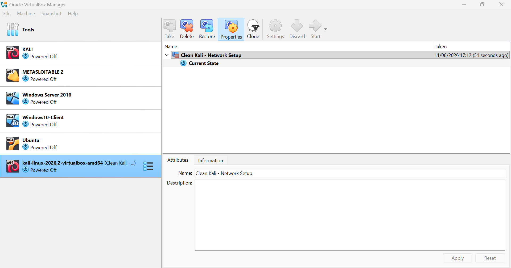

<div align="center">

# Cybersecurity Lab Environment Setup

**Building an isolated virtual lab for penetration testing and ethical hacking practice**
</div>

<p align="center">
  
  
  
  
  
  
  
  
  
  
  
   
</p>

---

## Project Overview

This project involves setting up a **virtual cybersecurity and penetration-testing laboratory** using VirtualBox and Kali Linux.

The purpose of the lab is to establish a controlled environment where cybersecurity tools, network scanning, reconnaissance, vulnerability assessment, and other security-testing activities can be safely performed and practiced.

The lab is configured on a private virtual network, allowing additional virtual machines to be added in the future and used as targets for authorized security testing.

The project also documents the configuration, testing, troubleshooting, and verification steps involved in establishing the laboratory environment.

---


## Objectives

The main objectives of this project are to:

- Install and configure **VirtualBox** as the virtualization platform.
- Install and import **Kali Linux** as a virtual machine.
- Set up a private **NAT Network** for the cybersecurity laboratory.
- Configure and test network connectivity within the Kali Linux VM.
- Assign a consistent IP address to the Kali Linux machine.
- Verify Internet connectivity and DNS resolution.
- Create a clean **VirtualBox snapshot** that can be used for recovery.
- Record and document the laboratory setup and configuration process.
- Establish a foundation for future **cybersecurity and penetration-testing exercises**.

---

## Purpose of the Lab

The purpose of this laboratory is to provide a **safe, isolated, and controlled environment** for practicing cybersecurity concepts and conducting authorized security-testing activities.

The laboratory can be used to perform exercises such as:

- Network reconnaissance
- Port and service scanning
- Vulnerability assessment
- Network packet analysis
- Web security testing
- Exploitation practice
- Testing and experimentation with cybersecurity tools

⚠️ **Important:** This laboratory and its security tools must only be used on systems that you own or have explicit authorization to test. Never use these tools against unauthorized systems or networks.
---

## Lab Architecture




Additional target machines can be added to the same virtual network in future projects.

---

## Lab Configuration

| Component       | Configuration      |
| --------------- | -----------------  |
| Host OS         | Windows 11         |
| Host RAM        | 8 GB               |
| Processor       | Intel Core i5      |
| Hypervisor      | VirtualBox 7.1.10  |
| Security OS     | Kali Linux 2026.2  |
| Kali RAM        | 2048 MB            |
| Virtual Network | NAT Network        |
| Network Address | 10.0.0.0/24        |
| Kali IP Address | 10.0.0.2/24        |
| Default Gateway | 10.0.0.1           |
| DNS Server      | 8.8.8.8            |
| Future VM Range | 10.0.0.3–10.0.0.99 |

---

# Lab Setup Procedure

## Step 1. Install 7-Zip

7-Zip was installed to extract the Kali Linux virtual-machine files when provided in a `.7z` compressed archive.

**Tool Used:** 7-Zip

---

## Step 2. Install VirtualBox

VirtualBox was installed and configured to serve as the **hypervisor** for the cybersecurity laboratory.

---

## Step 3. Configure the NAT Network

A dedicated **NAT Network** was created in VirtualBox to provide connectivity between virtual machines within the laboratory while allowing outbound network access.

The network was configured as follows:

```text
Network Name: NatNetwork
IPv4 Prefix:  10.0.0.0/24
DHCP:         Enabled
IPv6:         Disabled
```



The NAT Network configuration allows multiple virtual machines connected to the same network to communicate with each other.

It also provides a suitable foundation for adding additional attacker and target virtual machines during future authorized security-testing exercises.

---

## Step 4. Import Kali Linux

The Kali Linux virtual machine was obtained from the official Kali Linux source and imported into VirtualBox.

The network adapter was configured using the following settings:

```text
Adapter 1
Attached to: NAT Network
Network:     NatNetwork
Adapter Type: Intel PRO/1000 MT Desktop
```

The Kali Linux virtual machine was assigned:

```text
RAM: 2048 MB
```



A shared folder was also configured to allow files to be transferred between the host operating system and the Kali Linux virtual machine.


---

## Step 5. Configure the Kali Linux Network

The network settings of the Kali Linux VM were configured and verified to ensure consistent connectivity within the laboratory.

The configured network parameters were:

```text
IP Address: 10.0.0.2
Subnet Mask: 255.255.255.0
Gateway: 10.0.0.1
DNS: 8.8.8.8
```

Using a consistent IP address makes it easier to identify and reference the Kali Linux machine during subsequent laboratory exercises.



---

## Step 6. Create a Clean VM Snapshot

After completing the initial Kali Linux configuration, a VirtualBox snapshot was created to preserve the working state of the virtual machine.

The snapshot was named:

```text
Clean Kali - Network Setup
```

This snapshot serves as a clean baseline for the laboratory.

If a future cybersecurity exercise modifies the system configuration or causes an unexpected problem, the Kali Linux VM can be restored to this baseline and the laboratory setup can be reused.



---

# Lab Verification

| Test                        | Command                      | Expected Result              |
| ----------------------------- | ------------------------------- | ------------------------------- |
| Check IP address           | `ip a`                          | Correct Kali IP displayed       |
| Test gateway               | `ping 10.0.0.1`                 | Successful replies              |
| Test Internet connectivity | `ping 8.8.8.8`                  | Successful replies              |
| Test DNS resolution        | `nslookup networkwalks.com`     | Domain resolves                 |
| Verify Nmap                | `nmap --version`                | Nmap version displayed          |
| Verify snapshot            | Restore snapshot and run `ip a` | Baseline configuration restored |

### Example Results

```text
IP Address:
10.0.0.2/24

Gateway:
10.0.0.1

DNS:
8.8.8.8
```

---

# Problems Encountered & Solutions

Documenting problems is an important part of the project.

## Problem 1. Internet Connectivity After Static IP Configuration

After manually configuring the IPv4 settings, Internet connectivity may fail depending on the Kali/NetworkManager configuration.

One workaround used during this lab was:

```bash
sudo nmcli connection modify "Wired connection 1" ipv4.dad-timeout 0
```

The network connection was then restarted/rebooted and connectivity was tested again.

---

## Problem 2. Incorrect Date and Time

After installing Kali Linux, the system date and time were not set to the correct local time.

I checked the current time using:

```bash
timedatectl
```
Since the system was being used in Ghana, I configured the correct timezone using:

```bash
sudo timedatectl set-timezone Africa/Accra
```

I then verified the configuration using:

```bash
timedatectl
```

The Kali Linux system was successfully configured to use the correct Ghana timezone.

---

# What I Learned

This project helped me move from simply knowing cybersecurity concepts to actually working with a cybersecurity environment.

### 1. Working With Virtual Machines
I learned how to set up and manage a Kali Linux VM in VirtualBox and how different VM settings can affect its operation.

### 2. Understanding Network Configuration
I gained a better understanding of how IP addresses, gateways, DNS, and virtual network adapters work together to provide connectivity.

### 3. Using Linux for Network Verification
I became more comfortable using Kali Linux commands such as `ip a`, `ping`, `ip route`, and `nslookup` to check and troubleshoot network connectivity.

### 4. Solving Configuration Problems
I learned that problems such as a VM failing to start or losing Internet connectivity require investigation rather than simply reinstalling or changing settings.

### 5. Protecting My Lab Environment
Creating a clean snapshot taught me how to preserve a working version of my VM before experimenting with different configurations or tools.

### 6. Recording My Work
I learned to keep evidence of my configurations, tests, errors, and solutions. This makes it easier for me to understand what I did and reproduce the setup later.

### 7. Learning Through Hands-On Practice
The main thing I gained from this project was confidence in setting up and troubleshooting my own cybersecurity environment instead of relying only on theoretical knowledge. 

---

# Security & Ethical Use

This laboratory is intended strictly for education purposes only.

---

# Tools & Resources

- **7-Zip:** [https://7-zip.org/download.html](https://7-zip.org/download.html)
- **VirtualBox:** [https://virtualbox.org/wiki/Downloads](https://virtualbox.org/wiki/Downloads)
- **Kali Linux:** [https://kali.org/get-kali](https://kali.org/get-kali)

---

# Author

**OKUMBA-MITCHOWANOU EBENISERT-BIENVENU**\
Cybersecurity Student

LinkedIn: [https://www.linkedin.com/in/kumba-mitchowanou-ebenisert-bienvenu-299178352/](https://www.linkedin.com/in/okumba-mitchowanou-ebenisert-bienvenu-299178352/)

---

## Project Information

**Program Name:** Cybersecurity at Networkwalks | **Week:** 01 | **Project:** Cybersecurity & Pentesting Lab Setup | **Repository:** GitHub
